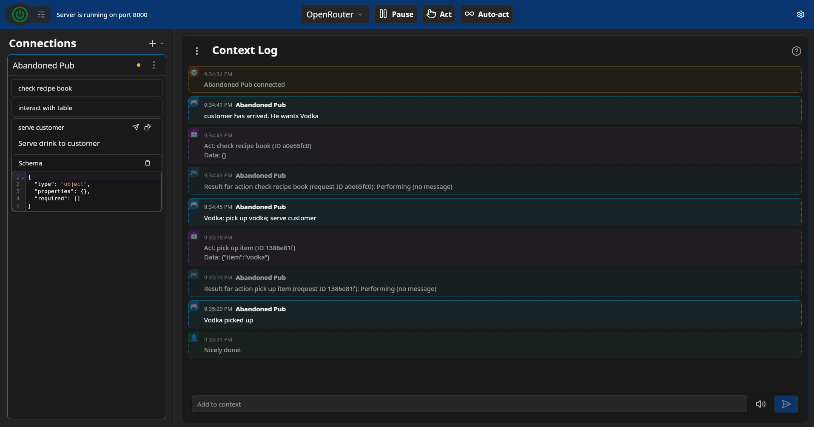
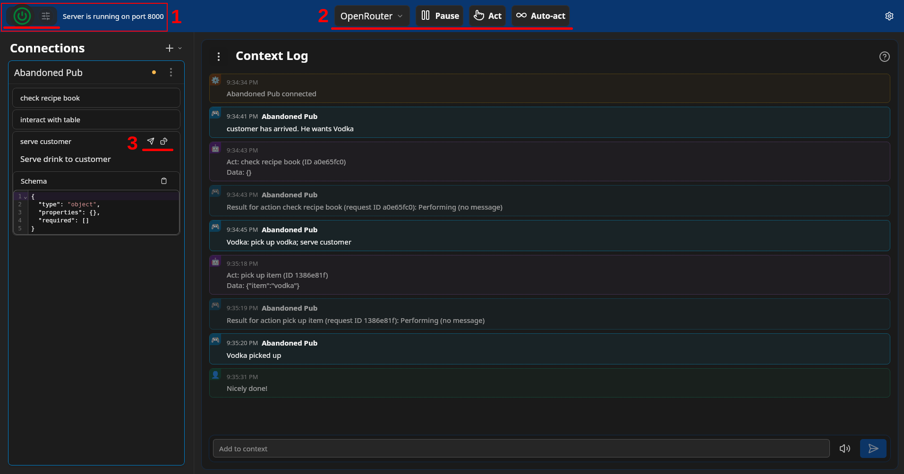

# Gaming Gary

A feature-rich app that helps you develop and test game integrations for the [Neuro-sama SDK](https://github.com/VedalAI/neuro-sdk), similar to [Tony](https://github.com/Pasu4/neuro-api-tony) and [Jippity](https://github.com/EnterpriseScratchDev/neuro-api-jippity).

## Features

A wide range of tools and environments to test your game integration, in one app.
- A random generator (like [Randy](https://github.com/VedalAI/neuro-sdk/blob/main/Randy/README.md)) to automatically choose actions, for primitive or "hands-off" testing
- Tony-like manual action sending, with an option to send raw WebSocket messages for low-level testing (e.g. SDK compliance)
- For advanced testing (closest to "production"), use a real LLM through OpenAI-compatible inference providers:
    - Local models can be used through local server hosts like [LMStudio](https://lmstudio.ai) or [Ollama](https://ollama.com)
    - [OpenRouter](https://openrouter.ai) is the recommended way to test, as you can easily use virtually *any* model.
    - You can add any other custom remote OpenAI-compatible service, but not all are guaranteed to work.
        - If something breaks, file an issue - but from my (limited) testing a lot of APIs are vibe coded so support will be on a best-effort basis.
- Diagnostics - easy automatic checks for common pitfalls and off-spec behavior.

The overall goal is to close and/or document the gap to the production system, letting you develop and test with confidence.
The app offers (in my opinion) a comfortable UI with hotkeys for ~~speedrunners~~ power users.

Compared to the previous Python app:
- Lighter and easier install (with auto-update)
- Finally supports remote providers
- Supports switching engines at runtime without having to restart
- Much more powerful, intuitive, and more stable UI (erm... except if you're [on Linux](#miscellaneous-jank) at the moment)

That said...
> [!Note]
> The app is currently in beta. Some areas or systems may change their behavior and/or internals (especially internals).
> The project is in active development so ~~don't be mean please 🥺👉👈~~ PRs are welcome. It's mostly for fun but I'm open to feedback and contributions.

## Quick start
Head over to [Releases](https://github.com/Govorunb/gary/releases/latest), download an installer appropriate for your platform/architecture, and install the app.

Out of the box, you can use Randy, send actions manually a-la Tony, or connect to an OpenAI-compatible API.

If you're not familiar with the Neuro-sama SDK, you should read a bit from the [architecture docs](docs/ARCHITECTURE.md) and the [unofficial](https://ktrain5169.github.io/neuro-sdk-docs/overview/) and [official](https://github.com/VedalAI/neuro-sdk/blob/main/API/SPECIFICATION.md) SDK docs to get a quick rundown. Otherwise, the basics of using the app are as follows:

1. Start the server and connect a game integration
2. Select and configure the engine that will perform actions automatically
3. Manually execute actions if desired

### Updating

The app will check for updates via [GitHub Releases](https://github.com/Govorunb/gary/releases/latest). Updates are checked on launch (by default, at most once a day).

If you're coming in from the old Python app, you may have just `git pull`ed in an update that removed your whole app - uhhh, sorry. You can run `git switch python-app` to return to the old branch. Otherwise, if you want to update to the new Tauri app, you don't need to clone the repo anymore - just download and install from Releases.

> [!Note]
> `.deb` installs currently don't support auto-installing updates. Sorry, it's an [issue upstream](https://github.com/tauri-apps/plugins-workspace/issues/3108).
> The app will still notify you if an update is available, but you'll have to manually go to Releases and download/install it.

### FAQ (nobody asked any of these so it's neither F nor A)

<b>I used the old Python app with my downloaded GGUFs, how do I use local models now?</b>

You can use a local inference provider like LMStudio/Ollama (my recommendation is LMStudio).

Chances are, if you play around with local models, you probably already have a local chat app installed. And, now that local inference providers have gotten fairly okay at structured outputs, there's very little reason for me to manage inference myself. I'd much rather focus on app development.

It's a win-win: I get to distribute a 5MB app, and you get to avoid compiling/downloading yet another 3 gigs of CUDA libraries to rot on your disk.

Thanks for listening to my TED talk.

<b>Don't have any local models downloaded? Not sure which to get or where?</b>

Look for a model that fits on your GPU. For example, if you have 8GB VRAM (which is [pretty common](https://store.steampowered.com/hwsurvey) these days), look for a model around 8B (billion) parameters. [Ministral 3](https://lmstudio.ai/models/mistralai/ministral-3-8b) is a good starting point.

To reduce the VRAM requirement (or if the model runs too slow), you can choose a [smaller quantization](https://simon-frey.com/blog/what-is-llm-quantization-simply-explained/) of the same model or try your luck with a [smaller model](https://lmstudio.ai/models/mistralai/ministral-3-3b).
You can also fiddle with settings in LMStudio to squeeze more of the model onto the GPU by reducing context window size (keep at least 8192 or it might get miserable) or enabling KV cache quantization - optimization is out of scope here, but just mess around.

On the other hand, if you have more VRAM or don't mind slower responses, you can look for a larger model - 13B/14B is the next step.

Generally, aim for a model/quantization whose file size is 1-2 GB below your VRAM (you can give it another GB of headroom to fit a bigger context window).

You may encounter models that have a certain number of "active" parameters (e.g. 30B total 3.5B active). Don't worry too much about it and use the larger number. LMStudio will show you whether the model likely fits on your device or not.

<b>I don't have the specs for a good model!</b>/<b>I'd rather go touch grass than fiddle with settings, can I pay to win?</b>

My recommended solution is [OpenRouter](https://openrouter.ai). Get your [API token](https://openrouter.ai/settings/keys), [find a model](https://openrouter.ai/models?fmt=cards&input_modalities=text&output_modalities=text&supported_parameters=structured_outputs) that supports structured outputs, and you're off. You can also look for [free](https://openrouter.ai/models?fmt=cards&input_modalities=text&output_modalities=text&supported_parameters=structured_outputs&max_price=0) models as well - with some caveats below.

If you don't want to think too much, `openai/gpt-oss-20b` (faster/cheaper) and `openai/gpt-oss-120b` (smarter) are decent options. You can also try adding `:free` to the end to see if there are any providers giving away their inference compute.

Otherwise, you can try a remote OpenAI-compatible inference provider. There are free and low-cost options out there - feel free to shop around - but not all of them may support the required generation techniques. Look for the phrase `Structured outputs` or `Tool calling` in the provider's documentation.

Note: Often, providers offer their services for free/cheap by gathering and retaining data (for training or otherwise). If you're both privacy-minded and resource-constrained, you might be better off sticking to smaller local models. There are some [tiny options](https://lmstudio.ai/models/google/gemma-3-1b) out there!

<b>It gets so much slower as the session goes on!</b>/<b>My session went on for a while and then it broke!</b>

Models have context windows that are limited in capacity. The more text in the context window, the slower it is to process - and when the limit is reached, the model can't process at all. You'll need to periodically reset the context by clicking the menu button next to the "Context Log" heading. This means the model's knowledge will be starting over from scratch! Try to find a good moment to reset the context. You can also add periodic reminders of game rules to your game (e.g. on starting a new round).

### Tips

#### Models
Success will largely depend on model size - with larger models generally more intelligent than smaller ones - which, for local models, depends on your hardware. For example, models under 8B parameters may not be able to perform logical leaps or multi-step actions in your game, placing a soft requirement of at least 6-8GB of VRAM to do useful LLM testing.

Because of this, Gary might turn out to be dumber than a rock (which is ironic because it's made of rock) - maybe even *worse than Randy*. If so, you either need to use a larger model (probably through a remote provider) or fall back to Randy/manual action sending instead. (Or use [Tony](https://github.com/Pasu4/neuro-api-tony)/[Jippity](https://github.com/EnterpriseScratchDev/neuro-api-jippity), whatever works for you.)

That being said, it's *always* better in the long run to invest effort into refining your prompts to make things clearer.
Getting a less intelligent model to successfully play your game will help more intelligent models make even smarter decisions.

#### Prompting (descriptions, context)
- Use direct and concise language
    - Having less text to process makes the LLM faster and more focused
    - Aim for high information density - consider running your prompts through a summarizer
- Do your best to keep a consistent tone
    - All context influences the response and context that is out-of-tone can throw off the model
    - (opinion) Flowery or long-winded descriptions should be used very sparingly
- Natural language (e.g. `Consider your goals`) is okay - it is a language model, after all
    - That said, language models are not humans - watch this short [video](https://www.youtube.com/watch?v=7xTGNNLPyMI) for a very brief overview of how LLMs work
- If you are testing with a small model (under 10B):
    - Keep in mind Neuro will probably act differently from your model
    - Including/omitting common-sense stuff can be hit or miss
    - Rules with structured info (e.g. with [Markdown](https://www.markdownguide.org/basic-syntax/)) seem to perform better than unstructured
    - Try more models (and try a bigger model - even if it's slower) to see what info is generally useful and what's just a quirk of your specific model

#### Managing context

When generating, LLMs generally pay more attention to the very first and the very last parts of the context. Therefore, consider the following:
- Send a description of the game and its rules on startup
- Keep context messages relevant to upcoming actions/decisions
    - Consider reminding the model of any relevant state immediately before asking it to make a choice
- Send reminders of rules/tips/state at breakpoints, e.g. starting a new round

If an action fails because of game state (e.g. trying to place an item in an occupied slot), you should attempt, preferably in this particular order:
1. Disallow the illegal action (by removing the illegal parameter from the schema, or by unregistering the action entirely)
    - This is the best option as there's no chance for mistakes at all (unless Neuro decides to ignore the schema)
2. Suggest a suitable alternative in the result message
    - For example, `"Battery C is currently charging and cannot be removed. Batteries A and B are charged and available."`
3. Send additional context as a state reminder on failure so the model can retry with more knowledge
4. Or, register a query-like action (e.g. `check_inventory`) that allows the model to ask about the state at any time and just hope for the best

### JSON schema support
Not all JSON schema keywords are supported by all providers. Unfortunately, I can't predict how every provider will handle this, so requests may error out - or, worse yet, your action schemas may silently get ignored.

> [!Warning]
> This means that the LLM **might not fully comply with the schema**.
> 
> It's very important that the game validates the backend's responses and sends back meaningful and interpretable error messages.

Following [the Neuro API spec](https://github.com/VedalAI/neuro-sdk/blob/main/API/SPECIFICATION.md#action) is generally safe. If you find an action schema is getting complex or full of obscure keywords, consider simplifying it or breaking it up into multiple actions.

#### Miscellaneous jank

Apologies to Linux users (if any) for [webkit2gtk's terrible performance](https://github.com/tauri-apps/tauri/issues/3988). I'll look into a workaround so you don't have to suffer.

Ollama on Windows requires a user workaround - see [issue #7](https://github.com/Govorunb/gary/issues/7).

### Implementation-specific behavior
There may be cases where other backends (including Neuro) may behave differently.

- Gary will always be different from Neuro in some aspects, specifically:
    - Processing other sources of information like vision/audio/chat (for obvious reasons)
    - Gary is not real and will never message you on Discord at 3 AM to tell you he's lonely 😔
    - Myriad other things like response timings, text filters, allowed JSON schema keywords, long-term memories, etc
- Gary sends `actions/reregister_all` on every connect (instead of just **re**connects, as in the spec)
    - Reminder: this command is still non-standard. Your game/SDK implementation should ideally proactively register actions on connect instead of relying on a prompt from the server (which may not ever come).

#### Acknowledgements
Thanks to all these lovely games for having Neuro integration so I didn't have to develop this blind:
- [Abandoned Pub](https://pipeheads.itch.io/abandoned-pub)
- [Branching Paths](https://shardhash.itch.io/branching-paths)
- [neuro scratch](https://tsgscraft.itch.io/neuro-scratch)
- and more!
