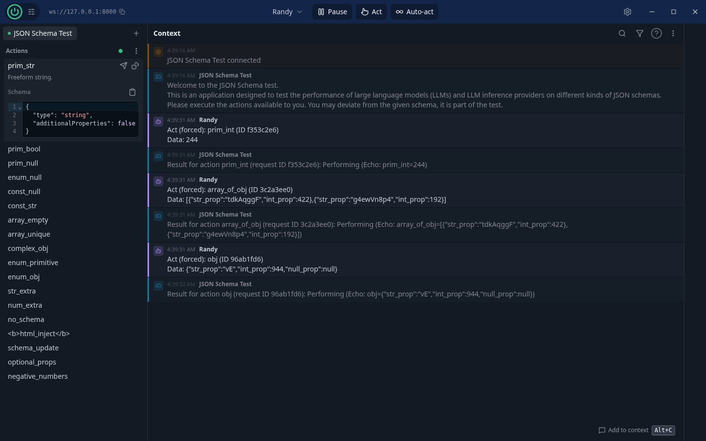
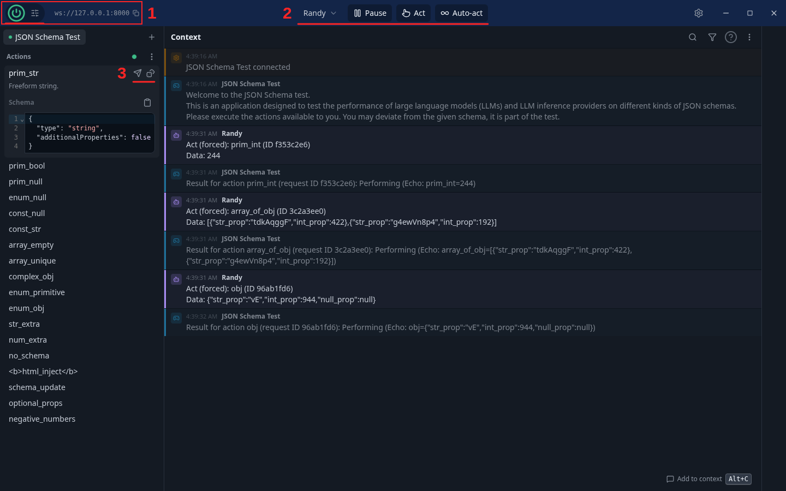

# Gaming Gary

A feature-rich app that helps you develop and test game integrations for the [Neuro-sama SDK](https://github.com/VedalAI/neuro-sdk). It's similar to [Tony](https://github.com/Pasu4/neuro-api-tony) and [Jippity](https://github.com/EnterpriseScratchDev/neuro-api-jippity), but aims to be a generalist testing app (able to do "everything" to some degree).

## Features

A wide range of tools and environments to test your game integration, in one app.
- A random generator (like [Randy](https://github.com/VedalAI/neuro-sdk/blob/main/Randy/README.md)) to automatically choose actions, for primitive or "hands-off" testing
- Tony-like manual action sending, with an option to send raw WebSocket messages for low-level testing (e.g. SDK compliance)
- For advanced testing (closest to "production"), use a real LLM through OpenAI-compatible inference providers:
    - Local models can be used through local server hosts like [LMStudio](https://lmstudio.ai) or [Ollama](https://ollama.com)
    - [OpenRouter](https://openrouter.ai) is the recommended way to test, as you can easily use virtually *any* model.
    - You can add any other custom remote OpenAI-compatible service, but not all are guaranteed to work.
        - If something breaks, file an issue - but from my (limited) testing a lot of APIs are vibe coded so support will be on a best-effort basis.
- Diagnostics - easy automatic checks for common pitfalls and off-spec behavior.

The overall goal is to close and/or document the gap to the production system, letting you develop and test with confidence.
The app offers (in my opinion) a comfortable UI with hotkeys for ~~speedrunners~~ power users.

Compared to the previous Python app:
- Lighter and easier install (with auto-update)
- Finally supports remote providers
- Supports switching engines at runtime without having to restart
- Much more powerful, intuitive, and more stable UI (erm... except if you're [on Linux](#miscellaneous-jank) at the moment)

That said...
> [!Note]
> The app is currently in beta. Some areas or systems may change their behavior and/or internals (especially internals).
> The project is in active development so ~~don't be mean please 🥺👉👈~~ I'm open to feedback and contributions.

## Quick start
Head over to [Releases](https://github.com/Govorunb/gary/releases/latest), download an installer appropriate for your platform/architecture, and install the app.

Out of the box, you can use Randy, send actions manually a-la Tony, or connect to an OpenAI-compatible API.

If you're not familiar with the Neuro-sama SDK, you should read a bit from the [architecture docs](docs/ARCHITECTURE.md) and the [unofficial](https://ktrain5169.github.io/neuro-sdk-docs/overview/) and [official](https://github.com/VedalAI/neuro-sdk/blob/main/API/SPECIFICATION.md) SDK docs to get a quick rundown. Otherwise, the basics of using the app are as follows:

1. Start the server and connect a game integration
2. Select and configure the engine that will perform actions automatically
3. Manually execute actions if desired

### Updating

The app will check for updates via [GitHub Releases](https://github.com/Govorunb/gary/releases/latest). Updates are checked on launch (by default, at most once a day).

If you're coming in from the old Python app, you may have just `git pull`ed in an update that removed your whole app - uhhh, sorry. You can run `git switch python-app` to return to the old branch. Otherwise, if you want to update to the new Tauri app, you don't need to clone the repo anymore - just download and install from Releases.

### Safe mode

If broken preferences somehow ever prevent Gary from starting normally, hold <kbd>Esc</kbd>+<kbd>F1</kbd> while launching to force safe mode. This won't work on Wayland, so use the `--safe-mode` CLI argument there instead.

### FAQ (nobody asked any of these so it's neither F nor A)

<b>I used the old Python app with my downloaded GGUFs, how do I use local models now?</b>

You can use a local inference provider like LMStudio/Ollama (my recommendation is LMStudio).

Chances are, if you play around with local models, you probably already have a local chat app installed. And, now that local inference providers have gotten fairly okay at structured outputs/tool calling, there's very little reason for me to manage inference myself. I'd much rather focus on app development.

It's a win-win: I get to distribute a 5MB app, and you get to avoid compiling/downloading yet another 3 gigs of CUDA libraries to rot on your disk.

Thanks for listening to my TED talk.

<b>Don't have any local models downloaded? Not sure which to get or where?</b>

For behavior testing, use a model in the 20-30B range or larger. 27B is a good starting point.

Smaller models (3B/9B/14B) are still useful for checking that Gary can connect, generate a response, and call your actions. They are not a good approximation of Neuro's capabilities (which have grown since Gary started off recommending these small models), so tailor your prompts and action schemas with the assumption that Neuro is (moderately) smarter than they are.

For local models, pick a [quantization](https://simon-frey.com/blog/what-is-llm-quantization-simply-explained/) whose file size leaves 1-2GB of VRAM for context and other overhead. Keep at least an 8192-token context window; KV cache quantization can help. Honestly, just play around with the settings in LMStudio. For models described with total and active parameter counts (e.g. 30B total/3.5B active), use the larger number when estimating whether it will fit.

A suitably intelligent model likely will not fit on most gaming GPUs, so you should look at using a hosted provider (next section!)

<b>I don't have the specs for a good model!</b>/<b>I'd rather go touch grass than fiddle with settings, can I pay to win?</b>

My recommended solution is [OpenRouter](https://openrouter.ai). Get an [API token](https://openrouter.ai/settings/keys) and use `openrouter/free` to get started without choosing a model. It selects from the available free models based on the features Gary needs.

If you want to choose one, `openai/gpt-oss-20b` (faster/cheaper, 20B total/3.6B active) and `openai/gpt-oss-120b` (smarter, 120B total/5.1B active) are reasonable cost-effective options. Make sure any other model supports [structured outputs](https://openrouter.ai/models?fmt=cards&input_modalities=text&output_modalities=text&supported_parameters=structured_outputs) or [tool calling](https://openrouter.ai/models?fmt=cards&input_modalities=text&output_modalities=text&supported_parameters=tools), whichever output mode you select in Gary.

Other OpenAI-compatible providers can work, but are not officially supported (meaning, fixing issues with these is best-effort and lower priority for me). Check for explicit structured-output or tool-calling support.

Note: Often, providers offer their services for free/cheap by gathering and retaining data (for training or otherwise). If you're both privacy-minded and resource-constrained, your selection will likely be limited (but there are some pretty cheap options out there).

<b>It gets so much slower/more expensive as the session goes on!</b>/<b>My session went on for a while and then the model got dumber!</b>

Models have context windows that are limited in capacity. The more text in the context window, the more expensive it is to process - and when the limit is reached, the model can't process at all.

There's two parts to the "getting dumber" part of it:
1. For many models, intelligence degrades as the context window fills up. I don't know the exact mechanism (there's likely more than one), but my guess is that there's more training data for small-context-window conversations (with only a few turns), so longer ones are more "out of distribution". And, it's just easier to answer a question with fresh context vs one full of distracting random stuff and irrelevant past messages.
2. Compaction/trimming. To avoid hitting the context window limit, Gary will periodically trim the context. This means the model may occasionally drop a bunch of knowledge from its working memory! You might want to send reminders of game rules from your integration on certain breakpoints (e.g. on starting a new round). Neuro will likely differ here since the official context management strategy isn't published.

### Tips

#### Models
Use Randy or manual sends to test the protocol, and smaller models to lightly test the complete LLM path on a surface level. Evaluating context, descriptions, action schemas, and expected behavior should be done with an appropriately-sized model (20-30B, as above).

If a smaller model fails, make sure you're able to reproduce the problem with a stronger model before changing your integration. Larger models can tolerate a lot more ambiguity and inconsistency.

Not sure how to prompt LLMs in general?

Make sure you've read the [official best practices](https://github.com/VedalAI/neuro-sdk/blob/main/API/BEST_PRACTICES.md) first.

- Use direct and concise language
    - Having less text to process makes the LLM faster and more focused
    - Aim for high information density - consider running your prompts through a summarizer
- Do your best to keep a consistent tone
    - All context influences the response and context that is out-of-tone can throw off the model
    - (opinion) Flowery or long-winded descriptions should be used very sparingly
- Natural language (e.g. `Consider your goals`) is okay - it is a language model, after all
    - That said, language models are not humans - watch this short [video](https://www.youtube.com/watch?v=7xTGNNLPyMI) for a very brief overview of how LLMs work
- Test important prompt changes with more than one capable model
  - If you're using small models, assume Neuro will be more intelligent. Mitigations for some failure modes (e.g. a small model failing to pick options out of a list) may not help Neuro, and may actually actively hinder her
  - More on this - each model has a "preferred prompting style" that best works for the individual model. There is basically no way to know this for Neuro, but using multiple different models will help you phrase your prompts more "neutrally"

### JSON schema support
Not all JSON schema keywords are supported by all providers. Unfortunately, I can't predict how every provider will handle this, so requests may error out - or, worse yet, your action schemas may silently get ignored.

> [!Warning]
> This means that the LLM **might not fully comply with the schema**.
> 
> It's very important that the game validates the backend's responses and sends back meaningful and interpretable error messages.

Following [the Neuro API spec](https://github.com/VedalAI/neuro-sdk/blob/main/API/SPECIFICATION.md#action) is generally safe. If you find an action schema is getting complex or full of obscure keywords, consider simplifying it or breaking it up into multiple actions.

#### Miscellaneous jank

Apologies to Linux users (if any) for [webkit2gtk's terrible performance](https://github.com/tauri-apps/tauri/issues/3988). I'll look into a workaround so you don't have to suffer.

### Implementation-specific behavior
There may be cases where other backends (including Neuro) may behave differently.

- Gary will always be different from Neuro in some aspects, specifically:
    - Processing other sources of information like vision/audio/chat (for obvious reasons)
    - Gary is not real and will never message you on Discord at 3 AM to tell you he's lonely 😔
    - Myriad other things like response timings, text filters, allowed JSON schema keywords, long-term memories, etc
- Gary has no support for [voice chat](https://github.com/VedalAI/neuro-sdk/blob/main/API/VOICE_CHAT.md) (for obvious reasons)
- Gary doesn't speak through audio, so `speech_finished` is sent immediately when the speech text is generated
  - This won't be sent if yapping is disallowed in engine config
- `actions/reregister_all` is [officially deprecated](https://github.com/VedalAI/neuro-sdk/blob/main/API/BEST_PRACTICES.md#disconnecting-and-reconnecting) but if you're working with an older integration, there's a compatibility setting for it in the server config

#### Acknowledgements
Thanks to all these lovely games for having Neuro integration so I didn't have to develop this blind:
- [Abandoned Pub](https://pipeheads.itch.io/abandoned-pub)
- [Branching Paths](https://shardhash.itch.io/branching-paths)
- [neuro scratch](https://tsgscraft.itch.io/neuro-scratch)
- [Skyrim](https://github.com/vituha230/Neuro-Skyrim-Integration)
- and more!
